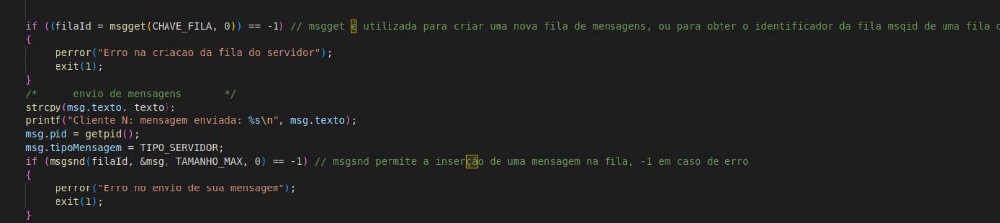
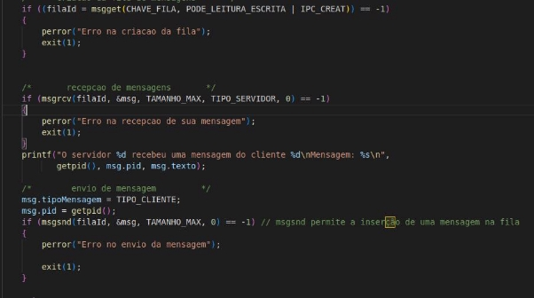
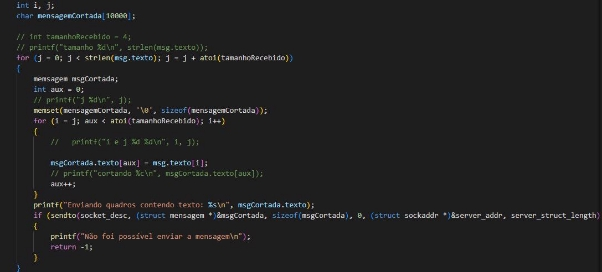
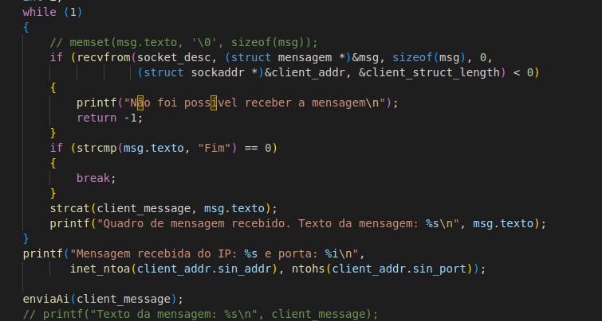
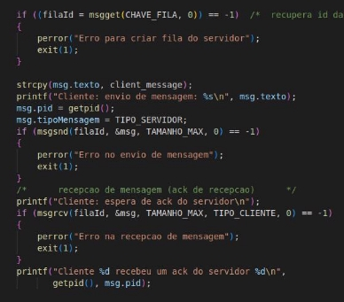
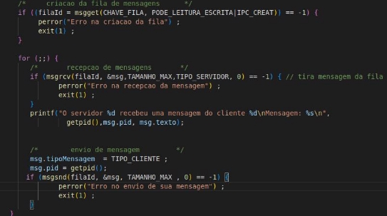
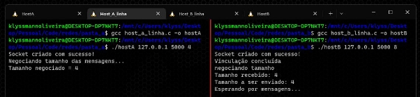
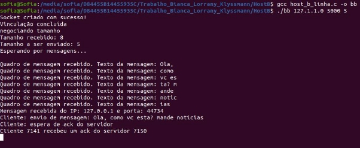

# Fundamentos-de-Redes-de-Computadores

Simulador de camada de enlace para a disciplina de Fundamentos de Redes de Computadores 2022/UNB

Fundamentos de Redes de Computadores

**Protótipo de camada de enlace de dados**

Brasília, DF 2022

1\. Introdução

Segundo (Tanenbaum, 2011), a missão da camada de enlace é fornecer interface de serviço para a camada de rede e transmitir bits à máquina destino, entregando-os até a camada de rede da mesma. Nesse contexto, a divisão do fluxo de bits advindos da camada física em quadros ocorre por meio de algumas técnicas, como:

1. contagem de caracteres;
1. bytes de flag com inserção de bytes;
1. flags iniciais e finais, com inserção de bits; e
1. violações de codificação da camada física

No enquadramento através da contagem de caracteres, um campo com um número de caracteres é adicionado ao cabeçalho do quadro. Assim, a camada de enlace é responsável, também, por detectar erros e corrigi-los, quando necessário . Esta camada também oferece algumas possibilidades de serviços, podendo ser serviço não orientado a conexões sem confirmação, serviço não orientado a conexões com confirmação e serviço orientado a conexões com confirmação.

Nesse sentido, o objetivo deste trabalho é implementar um protótipo que simula a camada de enlace, usando o serviço não orientado a conexões, com o diálogo ponto-a-ponto.

Figura 1: diálogo entre hosts. (Fonte Notas de aula)

3. Descrevendo a aplicação
1. Simplex

A aplicação funciona com dois hosts, sendo que cada host possui duas camadas: N e N-1. Dessa forma, o primeiro Host A envia uma mensagem para o outro Host B, sendo que esse último apenas escuta (modo simplex).

Assim, o primeiro passo é captar a mensagem que o lado A envia através da primeira camada, sendo ela recebida e enviada para uma fila de mensagens (será criada) que possui uma chave específica.

Figura 2: Trecho de uso de fila de mensagem. (Fonte: Elaboração própria).

Após enviar a mensagem para a fila, a aplicação espera que o outro lado receba a mensagem e confirme.

Figura 3: Trecho de código da confirmação de recebimento. (Fonte: Elaboração própria).

Nesse contexto, a camada mais abaixo busca a mensagem enviada, usando a mesma chave da fila e especificando o tipo de mensagem( pode ser do tipo cliente ou servidor).

Figura 4: Busca por mensagens. (Fonte: Elaboração própria).

Assim, a mensagem será passada para a camada mais abaixo do host B, sendo que essa comunicação acontece via socket. Como será explicado no item (3.2) sobre negociação, a camada mais abaixo do host A divide a mensagem em pequenas porções e envia para o host B via socket.

Figura 5: Envio via socket. (Fonte: Elaboração própria).

Após a divisão das mensagens em pequenas porções, a camada abaixo do host A envia uma mensagem via socket informando que a mensagem foi enviada completamente.

Figura 6: Envio via socket fim da mensagem. (Fonte: Elaboração própria).

Ao chegar no lado B, as funções de recebimento via socket são usadas e as mensagens são concatenadas e até o código de fim de mensagem.

Figura 7: Recebimento via socket. (Fonte: Elaboração própria).

Nesse ponto, resta apenas que o Host B passe a mensagem para a camada mais acima, ocorrendo o mesmo processo descrito para o Host anterior, ou seja, via fila de mensagens. Assim, a camada N-1 mais abaixo cria a fila, passando a mensagem recebida pelo socket e depois espera a confirmação da última camada.

Figura 8: Envio de mensagem via fila de mensagem. (Fonte: Elaboração própria).

Figura 9: Recepção de mensagem e confirmação. (Fonte: Elaboração própria)..

Limitações: Apesar de fazer a detecção de erros, a aplicação não trata a questão de enviar novamente a mensagem quando isso ocorre, nem elabora bons tratamentos para os erros.

2. Negociação entre os lados

A implementação da negociação foi realizada logo no início da execução dos processos das camadas inferiores do lado A e lado B. Após a criação do socket e da vinculação do do socket com a porta. O lado A envia uma mensagem com o tamanho máximo que ele pode enviar e o Lado B recebe essa mensagem, verifica se ele consegue enviar um tamanho maior ou menor e retorna o MENOR valor. O tamanho em que cada lado pode receber e enviar é informado no argumento da execução do processo no terminal.

Figura 10: Negociação do tamanho da mensagem. (Fonte: Elaboração própria)..

Assim, a cada mensagem que for enviada, o conteúdo dela será dividido no tamanho definido até que se encerre os processos e uma nova negociação só é realizada quando os processos forem executados novamente.

3. Imagens dos Terminais
1. Host A (envia a mensagem)

Figura 11:Terminal do host A camada N. (Fonte: Elaboração própria)..

Figura 12:Terminal do host A camada N-1. (Fonte: Elaboração própria)..

2. Host B (recebe mensagem)

Figura 13:Terminal do host B camada N-1. (Fonte: Elaboração própria)

Figura 14:Terminal do host B camada N. (Fonte: Elaboração própria)

4. Conclusão

Assim, foi realizado um protótipo que simula a camada de enlace, fazendo a comunicação como mostrado na Figura 1. Nem todos os protocolos da camada foram implementados, mas os principais, como negociar o tamanho da mensagem e o papel básico de passar a mensagem para o outro lado foram feitos com sucesso. 

5. Referências

WETHERALL, J.; TANENBAUM, A. S. Redes de Computadores. 5ª edição. Rio de Janeiro: Editora Campus, v. 5, p. 121, 2011.
